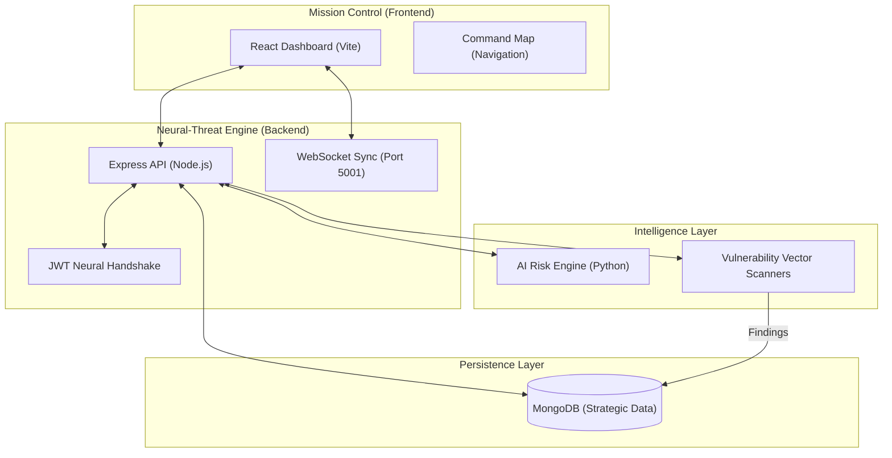

# 🛡️ CloudFortress AI: Elite Cloud Security Command Center

CloudFortress AI is a next-generation, enterprise-grade cybersecurity SaaS platform. It delivers automated, AI-driven tactical oversight and real-time vulnerability analysis for mission-critical cloud environments. By leveraging high-fidelity visualization and neural-handshake telemetry, CloudFortress AI empowers security operators with superior tactical intelligence across AWS, Azure, and GCP.

---

## ✨ Live Experience

Experience the elite CloudFortress AI tactical command center live:
[🔗 Access Live Mission Control](https://cloudfortress-ai.vercel.app)

> [!NOTE]
> If the live link is undergoing recalibration, follow the **Tactical Deployment** steps to synchronize the environment locally.

---

## 🏗️ Detailed Project Architecture

CloudFortress AI operates as a high-fidelity, multi-layered security ecosystem. The architecture is designed for real-time tactical synchronization and neural-threat orchestration.

### 🌐 System Overview (Mermaid)



### 🛰️ Core Ecosystem Breakdown

1.  **🚀 Mission Control (Frontend)**: A React 18-powered interface using **Vite** for high-performance delivery. Features **Framer Motion** for tactical UI transitions and **Recharts** for high-fidelity security analytics.
2.  **🧠 Neural-Threat Engine (Backend)**: An **Express.js** architecture orchestrating real-time telemetry via **Socket.io** on port 5001. Handles the **JWT Neural Handshake** for multi-tenant isolation.
3.  **📡 Intelligence Layer**: Leveraging **Python-based AI models** to perform adaptive risk scoring and specialized **Vulnerability Vector Scanners** that probe cloud-native services (S3, IAM, KeyVault).
4.  **💾 Strategic Persistence**: Managed via **MongoDB**, ensuring that tactical security findings and infrastructure metadata are stored with elite durability.

---


## 🚀 Strategic Visualization Modules


CloudFortress AI transcends traditional risk lists with advanced tactical dashboards:

- **🌐 Threat Surface Explorer**: A high-fidelity mapping of your global attack vectors, featuring real-time Exposure Indices and neural hazard heatmaps.
- **💠 Resource Sphere (Nexus)**: An interactive, force-directed asset graph providing 360° visibility into infrastructure connectivity and criticality.
- **🛰️ Neural-Threat Engine**: Real-time telemetry synchronization on port 5001, providing live alert feeds and adaptive risk scoring.

---

## 🛠️ Elite Tech Stack

- **Frontend**: React 18, Vite, Framer Motion (Tactical UI), Recharts (Fidelity Analytics), TailwindCSS (Enterprise Design System).
- **Backend**: Node.js, Express, Socket.io (Neural Sync), Mongoose.
- **Database**: MongoDB (Strategic Data Persistence).
- **Security**: JWT-based Neural Handshake, Multi-tenant Isolation, AES-grade Password Hashing.

---

## 🏗️ Tactical Deployment

To synchronize and deploy CloudFortress AI locally:

### 1. Repository Initializer
```bash
git clone https://github.com/pateldripal0025/CloudFortressAI.git
cd CloudFortressAI
```

### 2. Neural-Threat Engine Setup (Backend)
```bash
cd backend-express
npm install
# Configure .env with MONGODB_URI and JWT_SECRET
node server.js
```

### 3. Mission-Control Interface (Frontend)
```bash
cd ../frontend
npm install
npm run dev
```

---

## 📖 Operational Usage

- **Command Center**: Access the primary dashboard at `http://localhost:5173/dashboard`.
- **Vector Scans**: Execute deep-infrastructure scans via the 'Execute Vector Scan' command.
- **Tactical Handover**: All configurations are synchronized via the `api.js` tactical service.

---

## 🤝 Tactical Contributions

We welcome elite insights and tactical contributions. Please fork the repository and submit a Pull Request.

## 📄 Mission License

This project is licensed under the MIT License - see the LICENSE file for details.
