# CloudFortress AI: Real-Time Threat Scanning Architecture & Prototype

This document describes the design, implementation, and verification steps for the **Real-Time continuous threat scanning** module in CloudFortress AI.

---

## 🛰️ 1. Architecture Overview

Real-time scanning replaces heavy and slow periodic account discovery with **event-driven micro-scanning**. The flow from a cloud resource creation/modification event to a live UI alert is depicted below:

```mermaid
sequenceDiagram
    autonumber
    participant Cloud as Cloud Provider (EventBridge/EventGrid)
    participant PyAPI as FastAPI Backend (:8000)
    participant Scanner as RealtimeScanner (Python Engine)
    participant Mongo as MongoDB (Data Store)
    participant Express as Express Gateway (:5001)
    participant UI as React Frontend (:5173)

    Cloud->>PyAPI: POST /api/v1/realtime/event (Webhook Event)
    Note over PyAPI: Event queued as non-blocking background task
    PyAPI->>Scanner: process_cloud_event(event)
    
    rect rgb(10, 25, 47)
        Note over Scanner: Micro-scans targeted S3/SG/IAM config
        Scanner->>Mongo: Persist detected misconfigurations to 'risks'
    end
    
    Scanner->>Express: POST /api/alerts/realtime (Webhook Alert)
    Express->>UI: Emit 'new_notification' (Socket.io)
    UI->>UI: Play alert sound & render Toast + Bell Counter
```



---

## 🛠️ 2. Core Prototype Components

We have implemented the entire end-to-end prototype pipeline across three layers:

### A. Python AI Engine Layer
1. **Real-time Event Processor** (`backend/app/scanners/realtime_scanner.py`):
   - Implements `RealtimeScanner` that ingests JSON cloud events.
   - Performs targeted micro-scans using existing AWS/Azure misconfiguration rules.
   - Directly saves threats to MongoDB.
   - Pushes inter-service alerts to the Express gateway webhook.
2. **Webhook Router** (`backend/app/api/v1/realtime_routes.py`):
   - Mounts the `/api/v1/realtime/event` endpoint.
   - Offloads scanning tasks to `BackgroundTasks` so the API response remains instant (sub-10ms).
3. **Router Registry** (`backend/app/api/v1/router.py`):
   - Integrates and mounts the real-time scanning endpoints globally.

### B. Express Gateway Layer
* **Socket.io Webhook Receiver** (`backend-express/routes/v1Routes.js`):
  - Created a dedicated `/api/alerts/realtime` route.
  - Broadcasts structured security feeds over Socket.io `new_notification` and refreshes dashboard widgets via `scan_completed`.

### C. Simulation Tool
* **Interactive Trigger** (`backend/simulate_realtime_alert.py`):
  - A lightweight testing script that simulates a critical S3 Bucket public vulnerability event and posts it directly to the running FastAPI engine.

---

## 🚀 3. How to Run the Prototype

To see the real-time pipeline in action:

### Step 1: Fix & Start the Python Backend
If you haven't already, fix your venv and run the backend:
```powershell
# 1. Run the venv fix script we created
.\fix-backend-venv.bat

# 2. Start services (starts Express backend, MongoDB, Redis, and AI Engine)
.\start-services.bat
```

### Step 2: Open the Frontend Dashboard
Navigate to `http://localhost:5173` in your browser and log in to open your **CloudFortress AI | Cybersecurity Dashboard**.

### Step 3: Trigger the Real-Time Scan Simulation
Open a separate terminal window and execute the simulation script:
```powershell
cd "c:\infodesk\CloudFortress AI\backend"
python simulate_realtime_alert.py
```

### Step 4: Watch the Magic Happen!
As soon as the script executes:
1. The **FastAPI background worker** performs the micro-scan.
2. An alert is sent to **Express** and broadcast over **Socket.io**.
3. In the browser, you will immediately see a **live security toast alert** slide onto the screen, accompanied by an alert chime.
4. The **Security Feed (Bell Icon)** counter increments dynamically without page refreshes.
